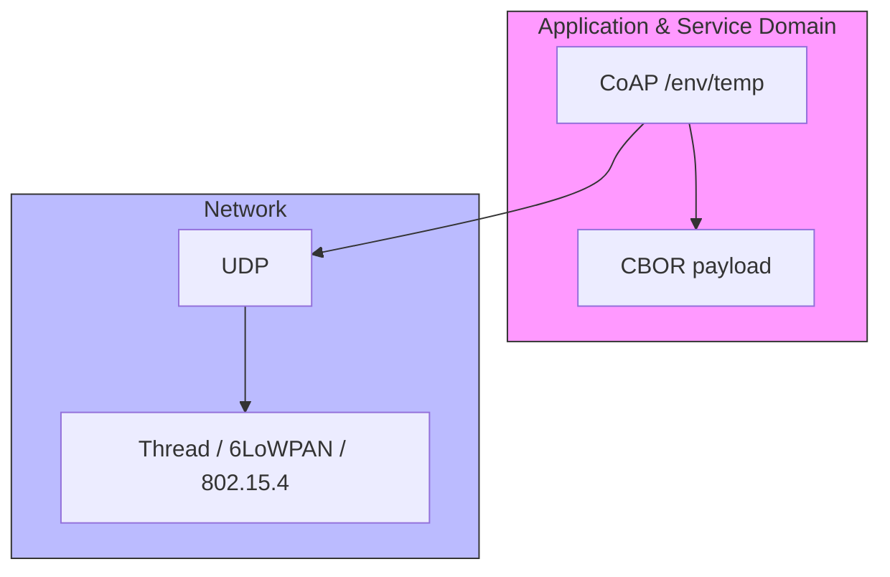

# Lab 3: Efficient Data Transport (CoAP & CBOR)
> **Technical Guide:** [SOP-03: Thread/CoAP Basic](sops/sop03_coap_basic.md) — firmware paste, build steps, troubleshooting.
> **Lecture:** [lab3_lecture.md](lectures/lab3_lecture.md)

**GreenField Technologies — SoilSense Project**

**Phase:** Application Optimization

**Duration:** 3 hours

**ISO Domains:** ASD (Application & Service), SCD (Sensing & Controlling)

---

## 1. Project Context

**From:** Daniela (Pilot Customer) via Product Team — *"Batteries die in 4 days, dashboard takes forever to update."*

You shipped HTTP/JSON in [Lab 0](../0_2_Minimal_IoT_Implementation_http.md) and MQTT in [Lab 0.5](../0_3_Minimal_IoT_Implementation_mqtt.md). Both keep the radio on too long for a battery-powered Thread node. **Mission:** switch the sensor uplink to **CoAP + CBOR**, with **Observe** replacing polling. Goals: ≥40 % packet-size reduction; push-on-change instead of poll.

| Stakeholder | Their question | How this lab answers |
|---|---|---|
| **Daniela (Farmer)** | Why do batteries die so fast? | CoAP/UDP + Observe slashes radio-on time per reading. |
| **Cloud Team** | Why is ingress bandwidth so high? | CBOR is ~1.7× smaller than JSON. |
| **ISO 30141 Auditor** | Is the data interface documented? | You publish an ASD service contract (§3 below). |

---

## 2. ISO/IEC 30141 placement



**Mostly ASD, with a foot in SCD.** The Thread mesh + UDP transport from Lab 2 stay where they were (SCD's communication subsystem). What you add today — the URI `/env/temp`, the CBOR data contract, the Observe interaction pattern — is squarely **ASD**. Lab 5's Border Router is what later bridges this ASD contract to **RAID** for outside consumers.

**Functional / management plane separation (ISO §6.2.2.3.3):** CoAP carries application data; Thread MLE handles routing and leader election. Independent — you can swap CoAP for MQTT-SN without touching MLE.

---

## 3. The API contract — `/env/temp`

This is the artifact you cite in ADR-003 and add to your DDR §4 (ISO Mapping → ASD entries). The firmware in [SOP-03 §5](sops/sop03_coap_basic.md#5-create-maincoap_democ) produces exactly this — if you change the firmware, change this section first.

| | |
|---|---|
| **Resource** | `/env/temp` |
| **Transport** | CoAP / UDP / port 5683 |
| **Methods** | `GET`, `GET + Observe` (RFC 7641) |
| **Content-Format** | `60` (`application/cbor`) |
| **Observe policy** | NON; notify only when `|new − last_notified| > 0.5 °C`; 24-bit seq with wrap |

**Payload (always 6 bytes):**

```
A1            map(1)
61 74         text(1) "t"
F9 hh ll      float16, big-endian, IEEE 754 half-precision
```

| `t` | Wire bytes |
|---|---|
| 0.0 | `A1 61 74 F9 00 00` |
| 24.5 | `A1 61 74 F9 4E 40` |
| 25.0 | `A1 61 74 F9 4E 80` |
| -10.0 | `A1 61 74 F9 C9 00` |

**CDDL schema (RFC 8610):**

```
env-reading = {
  t: float16   ; air temperature, degrees Celsius
}
```

**Response codes:** `2.05 Content` on success and on each Observe notification; `4.04 Not Found` on path mismatch; `4.05 Method Not Allowed` for anything but GET.

---

## 4. Execution

The firmware is provided in full — [SOP-03 §1–§5](sops/sop03_coap_basic.md). Paste, build, flash two boards, commission the Thread mesh from Lab 2, run `coap get` and `coap observe` from Node B's CLI. **You author no C code beyond two declaration lines** that the SOP shows you exactly where to place. The lab is observed and evaluated entirely from the two `idf.py monitor` terminals — same workflow as Lab 2. (A graphical dashboard exists as an [optional stretch goal](sops/sop03_coap_basic.md#appendix--optional-a-local-dashboard-stretch-goal) in the SOP appendix; it adds nothing to the rubric and we bring it back as a first-class artifact in Lab 6.)

### Task A — API live check
- `coap get fd<...>::1 /env/temp` from Node B.
- Decode the 6 returned bytes and verify they match the contract in §3.
- **Evidence:** Node B log + your decode + one-line statement of conformance.

### Task B — Observe vs polling
- Run `coap observe` for ≥ 5 minutes.
- **Count** notifications received (from the server log: `Δ=... exceeds threshold; notifying observers`); compare to the GETs a 1 Hz polling client would have made over the same window (= seconds elapsed).
- **Evidence:** server log + the ratio (notifications / polls-avoided).

### Task C — Efficiency audit (the headline number)

For a single `{"t": 24.5}` reading, here is the on-wire cost of each protocol you've used in this course. Fill in the **Your CoAP measurement** column from your own logs ([SOP-03 §6](sops/sop03_coap_basic.md#6-packet-size-audit-for-task-c) walks the byte arithmetic):

| Stack | One-reading exchange | Bytes on the wire | Packets | vs CoAP |
|---|---|---|---|---|
| **HTTP / JSON** (Lab 0)    | TCP SYN/SYN-ACK/ACK + GET + 200 OK + FIN×2  | **~500 B**        | 6   | 14× |
| **MQTT / JSON** (Lab 0.5)  | PUBLISH (already-open TCP socket)            | **~40 B**         | 1\* | 1.1× |
| **CoAP / CBOR** (today)    | One UDP datagram                              | **~36 B** (your number: ____) | 1 | 1× |

\* MQTT counts 1 packet *per reading*, but it pays a one-time TCP + MQTT CONNECT (~7 packets) at startup and a TCP keep-alive every ~60 s, both invisible per-reading but very visible on the energy budget.

**Deliverable in your DDR:** the table above with your measured CoAP number filled in, plus one sentence explaining why MQTT-on-Wi-Fi looks competitive on bytes/reading but loses on energy (TCP socket held open, keepalives, broker round-trip — none of which CoAP needs).

---

## 5. Deliverables — DDR updates

Update [your DDR](../3_deliverables_template.md):

- **§2 Lab Log → "Lab 3: Thread & CoAP" → To Daniela.** Two short paragraphs: how much smaller is one reading, how much less radio-on per minute under Observe vs polling, what it means for batteries.
- **§3 ADR-003: Use CoAP/UDP + CBOR for sensor uplink.** Context, decision, rationale (cite the §3 contract and your Task C numbers), status. Explicitly state why MQTT (Lab 0.5) was *not* chosen for the radio side.
- **§4 ISO Mapping.** Add `/env/temp` and the CDDL schema as ASD entries; CoAP as an Application Interface capability.
- **§5 First Principles, Lab 3.** One sentence each: why CoAP gets away with UDP where HTTP can't; why Observe saves battery vs `GET every 60 s`; why CBOR is not a custom binary format.
- **§6 Performance Baselines.** Fill in the "Lab 3: CoAP Latency" row from your `coap get` round-trip — target < 200 ms over 1 hop.
- **§7 Ethics & Sustainability.** Sustainability check is the Task B ratio; transparency check is the §3 contract being publishable.
- **Energy calculation.** If CoAP saves 50 ms of radio time per transmission, how much battery life is added over a year? Use the radio-RX current from [references.md](../references.md) and the duty cycle implied by your Observe rate. Show the work.

---

## Grading rubric (100 pts)

**Technical execution (40)** — `/env/temp` + CBOR working (15) · Observe push functional (15) · Packet-size comparison (10)

**ISO/IEC 30141 alignment (30)** — ASD service contract documented (15) · Protocol stack mapping (15)

**Analysis (20)** — ADR-003 justification (10) · Energy calculation (10)

**Ethics (pass/fail)** — Sustainability: Observe actually reduced traffic vs Polling · Transparency: CBOR/CDDL documented so others can decode it
