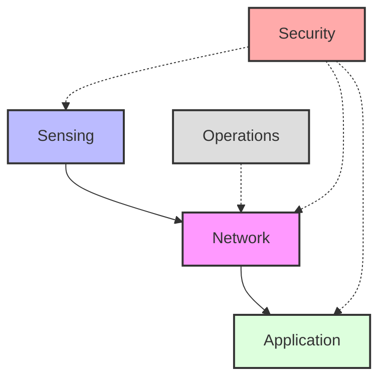

# Lab 8: Capstone Integration (The "Golden Master")
> **Technical Guide:** [SOP-08: Consolidation & Hardening](sops/sop08_consolidation.md)

**GreenField Technologies - SoilSense Project**
**Phase:** Production Release
**Duration:** 2 Weeks (Final Sprint)
**ISO Domains:** All Domains (System View)

---

## 1. Project Context

### Your Mission This Week

**From:** Samuel Cifuentes (Senior Architect)
**To:** Firmware Team
**Subject:** FIELD DEPLOYMENT GO/NO-GO

This is it. GreenField has the pilot deployment scheduled for next Monday.
We need the **Golden Master (v1.0)** firmware.

**The Exam:**
I will take your binary. I will flash it to 3 nodes in the lab.
I will run the "Chaos Script":
1.  Cut power to the Border Router.
2.  Jam the WiFi.
3.  Flood the network with traffic.
4.  Reboot the nodes randomly.

**If your system survives and recovers automatically, you pass.**
If I have to press the "Reset" button even once, we fail the pilot.

Good luck.

— Samuel

### Stakeholders Counting On You

| Stakeholder | Their Question | How This Lab Helps |
|---|---|---|
| **Everyone** | "Does it actually work?" | This is the Final Acceptance Test (FAT). |

---

## ISO/IEC 30141 Context

### Visual Domain Mapping

---

## 2. The Final Checklist (ISO 30141 Viewpoints)

Before you submit `soilsense_v1.bin`, verify your **DDR**:

### System View (Lab 1 & 5)
* [ ] Does the Radio connect reliably?
* [ ] Does it reach the Cloud?

### Functional View (Lab 2 & 4)
* [ ] Does the Mesh heal if a router dies?
* [ ] Do actuators work even after sleeping?

### Usage View (Lab 3 & 7)
* [ ] Is the data CBOR compressed?
* [ ] Can we see Battery levels?

### Trustworthiness View (Lab 6)
* [ ] Is DTLS encryption enabled?
* [ ] Are threats mitigated?

## 2b. Construction Viewpoint: IoT System Pattern

ISO/IEC 30141 Section 6.7 defines the **Construction Viewpoint** -- the standard's way of saying "show me what you built and how the pieces fit together." It uses **IoT System Patterns** (Table 12) to describe a concrete IoT architecture in terms of its components, networks, capabilities, and interfaces.

Complete the following IoT System Pattern template for your finished SoilSense system. Each row maps to a pattern element from the standard. Fill in the right column with what applies to your deployment.

| Pattern Element | Category | Your SoilSense Implementation |
|---|---|---|
| **IoT System** | -- | SoilSense v1.0 |
| **IoT Components** | Physical entities | _e.g., 3x sensor nodes, 1x border router, 1x dashboard server_ |
| **Digital Network** | Connectivity | _e.g., Thread mesh (802.15.4) + WiFi backhaul to dashboard_ |
| **IoT Devices** | Hardware | _e.g., ESP32-C6 with soil moisture + temperature transducers_ |
| **Primary Capability** | Physical observation | _What physical quantities does the system observe?_ |
| **Primary Capability** | Control of entities | _What actuations does the system perform (if any)?_ |
| **Secondary Capability** | Data processing | _e.g., CBOR encoding, threshold alerting_ |
| **Secondary Capability** | Data transferring | _e.g., CoAP over Thread, HTTP to cloud_ |
| **Secondary Capability** | Data storage | _e.g., local flash ring-buffer, cloud time-series DB_ |
| **Interface** | Network | _e.g., IEEE 802.15.4 (Thread), WiFi (802.11)_ |
| **Interface** | Human UI | _e.g., web dashboard, LED status indicators_ |
| **Interface** | Application | _e.g., CoAP resources: /sensor/moisture, /sensor/temp_ |
| **Supplemental** | Security | _e.g., DTLS 1.2 over Thread, TLS to cloud_ |
| **Supplemental** | Orchestration | _e.g., Thread leader election, mesh routing_ |
| **Supplemental** | Management | _e.g., OTA firmware updates, battery telemetry_ |

Compare your table to the system you actually flashed. If a row is empty, that is a gap worth noting -- either you did not implement it, or you did not document it.

> **For your DDR:** Include the completed IoT System Pattern table in your DDR final version (Section 8 or an appendix). This is the single-page summary an architect would hand to a reviewer to explain the system's construction.

---

## 3. The Stress Test (Self-Audit)

Perform these tests yourself before submitting:

1.  **The "Cold Start":** Remove all batteries. Insert them. Does the network form in < 2 minutes?
2.  **The "Blackout":** Turn off the Border Router for 10 minutes. Turn it on. Do nodes reconnect?
3.  **The "Long Haul":** Leave it running overnight. Are there 0 crashes?

---

## 4. Deliverables (The Final Package)

1.  **Binary:** `soilsense_v1.bin`
2.  **DDR Final Version:** Complete history of all 8 labs.
3.  **IoT System Pattern:** Completed Construction Viewpoint table (from Section 2b) showing all components, capabilities, and interfaces.
4.  **Video Demo:** A 2-minute video showing:
    * Sensor heating up (Data change).
    * Dashboard updating.
    * Node disconnection & recovery.
5.  **Ethics Assessment:** Completed Section 11 of your DDR.

---

## Grading Rubric (Total: 100 points)

### Technical Execution (50 points)
* [ ] **The Stress Test**: System recovers automatically (0 intervention) (20 pts)
* [ ] **Feature Complete**: All Lab 1-7 features present (10 pts)
* [ ] **Code Quality**: Clean, commented, no hardcoded secrets (10 pts)
* [ ] **Video Demo**: Clearly demonstrates functionality (10 pts)

### ISO/IEC 30141 Alignment (30 points)
* [ ] **DDR Final**: All ADRs and Viewpoints completed (10 pts)
* [ ] **System View**: Clear understanding of how domains interact (10 pts)
* [ ] **Construction Viewpoint**: IoT System Pattern table complete and accurate (10 pts)

### Ethics & Sustainability (20 points)
* [ ] **Final Ethics Assessment**: Thoughtful answers to the reflection questions (10 pts)
* [ ] **Sustainability Check**: End-of-Life plan and low-power verification (10 pts)

### Ethics Checkpoint (Mandatory Pass/Fail)
* [ ] **Responsible Engineering**: Do you stand by this system? Would you let your family use it?
* [ ] **Safety**: Verified that failure modes fail safe (e.g., valve closes on loss of signal).

---

## 5. Final Ethics Assessment

*Reference: [4_ethics_sustainability.md](../4_ethics_sustainability.md)*

Before declaring your system production-ready, complete this ethical review:

### System-Level Ethics Checklist

**Privacy & Data**
- [ ] We documented exactly what data SoilSense collects (DDR Section 11)
- [ ] Daniela can access all her data
- [ ] Daniela can delete her data if she leaves the service
- [ ] Data retention period is defined and justified

**Sustainability**
- [ ] System works without cloud (local-first via Border Router)
- [ ] ESP32-C6 can be repurposed after project ends
- [ ] OTA updates extend device lifespan (not planned obsolescence)
- [ ] Open protocols (Thread/CoAP) prevent vendor lock-in

**Stakeholder Impact**
- [ ] We considered who could be harmed if system is misused
- [ ] We have mitigations for identified risks

### Final Reflection (Include in DDR)

**Answer these questions in your DDR Section 11:**

1. If GreenField Technologies shuts down in 5 years, will Daniela's sensors still work? How?

2. What data could we stop collecting without losing core functionality?

3. Who benefits from this system? Who might be disadvantaged?

4. What would you do differently if you rebuilt this system with ethics as a primary requirement from day one?

---

**Congratulations. You are now an IoT Systems Architect.**

You've built a complete system spanning all six ISO/IEC 30141 domains, and you understand that engineering excellence includes ethical responsibility.

*"The best engineers build systems that not only work, but that they would be proud to explain to anyone affected by them."*
